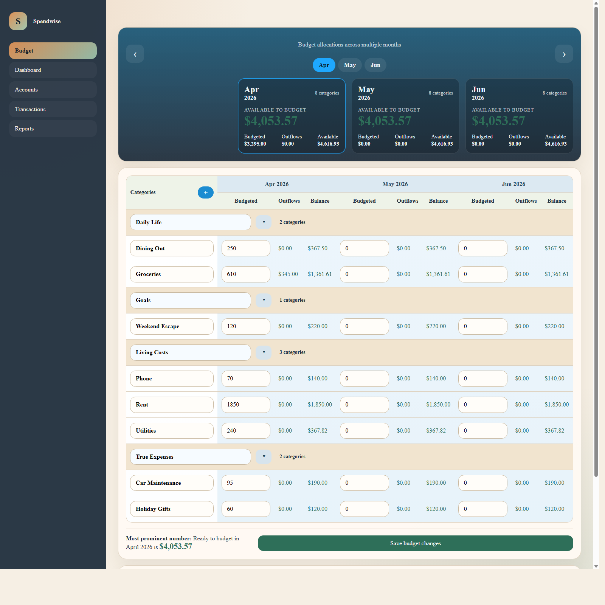
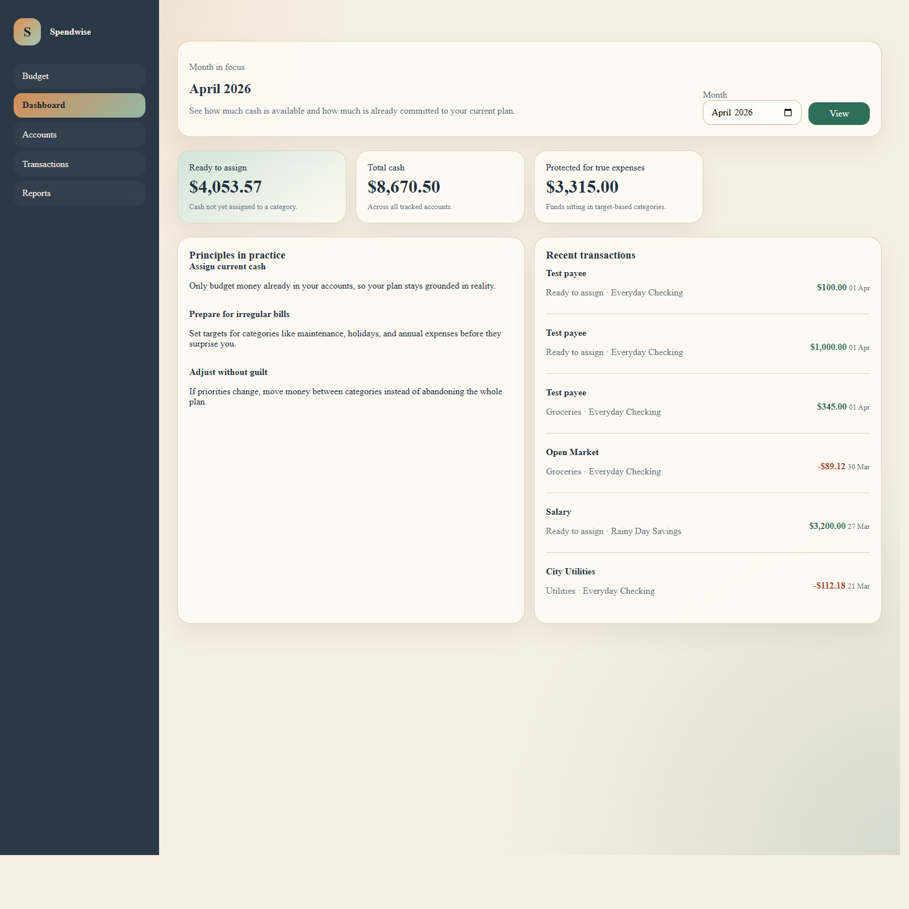
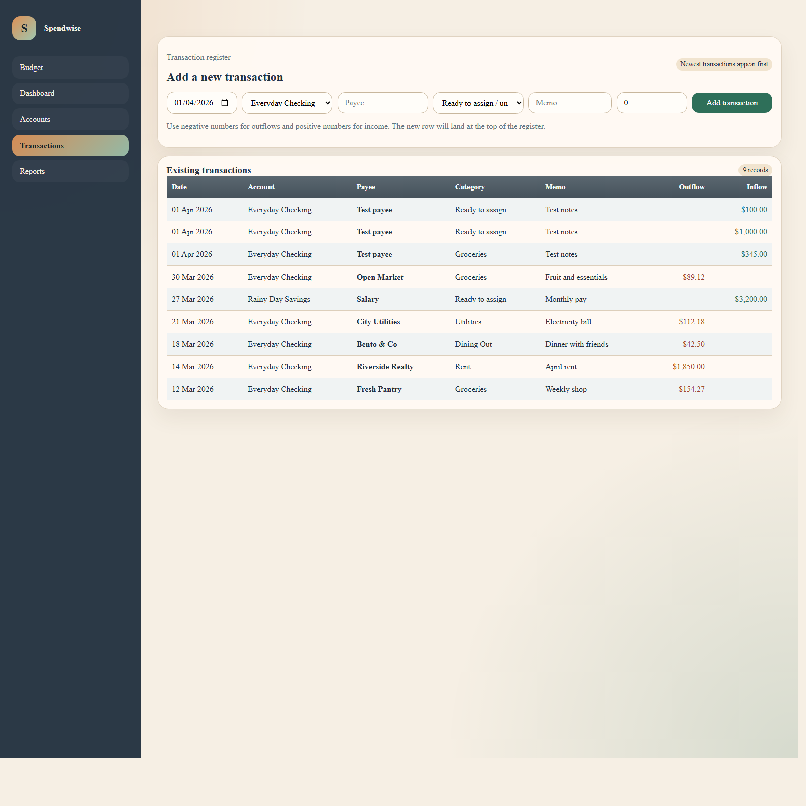

# Spendwise User Guide

Spendwise is a simple zero-based budgeting app for planning the money you already have. You can assign money to categories month by month, record transactions, update account balances, and move money between categories when priorities change.

Screenshots in this guide were captured from the app's built-in demo data.

## Main Navigation

Use the menu on the left to move between the main areas:

- `Budget`: plan category amounts across multiple months
- `Dashboard`: see high-level totals and recent activity
- `Accounts`: update account balances and add new accounts
- `Transactions`: enter income and spending, newest first
- `Reports`: review spending by group and progress against category targets

## Budget Page

The Budget page is the main planning screen.

### What you see

- `Available to budget` cards at the top for the visible months
- A category table underneath, split into month columns for `Budgeted`, `Outflows`, and `Balance`
- Category groups such as `Living Costs`, `Daily Life`, or `Goals`
- A `Save budget changes` button at the bottom of the table
- A `Move money` section for shifting money between categories in the selected month

### Common tasks

#### Assign money to categories

1. Open the `Budget` page.
2. Find the category you want to fund.
3. Enter a value in the `Budgeted` column for the month you want.
4. Repeat for any other categories.
5. Select `Save budget changes`.

#### View different months

- Use the month tabs at the top to jump the budget window forward.
- Use the left and right arrow buttons to move the visible month range backward or forward.

#### Rename a category group

1. Find the group header row, such as `Daily Life`.
2. Edit the group name directly in the text box.
3. Save the budget.

#### Collapse or expand a category group

- Click the arrow button to the right of the group name.
- Click it again to expand the categories back out.

#### Rename a category

1. Edit the category name directly in the category row.
2. Save the budget.

#### Add a new category

1. Click the `+` button next to `Categories`.
2. In the modal, enter the new category name.
3. Choose either:
   - an existing group, or
   - a new group name
4. Click `Create category`.

#### Move money between categories

1. Scroll to the `Move money` card under the budget table.
2. Choose the month.
3. Choose the source category.
4. Choose the destination category.
5. Enter the amount.
6. Click `Move money`.

## Dashboard

The Dashboard gives you a quick summary for one month.

### What you see

- `Ready to assign`: money not yet assigned to any category
- `Total cash`: total across tracked accounts
- `Protected for true expenses`: money currently sitting in target-based categories
- A short list of recent transactions

### Common tasks

- Change the month with the month picker in the top-right card.
- Use this page when you want a quick health check before making changes on the budget page.

## Transactions Page

The Transactions page works like a register, with the entry row at the top and existing transactions listed below.

### Add a transaction

1. Open `Transactions`.
2. Fill in the date.
3. Choose the account.
4. Enter the payee.
5. Choose a category.
6. Optionally add a memo.
7. Enter the amount.

Amount rules:

- Use a negative number for spending, such as `-54.20`
- Use a positive number for income, such as `1500.00`

When you add a transaction:

- it appears at the top of the list
- the account balance is updated
- categorized spending affects the month's outflows and balances

### Existing transaction list

The table below the entry row is sorted newest first. Each row shows:

- date
- account
- payee
- category
- memo
- outflow
- inflow

## Accounts Page

Use `Accounts` to keep tracked balances current.

### What you can do

- add a new account
- update the balance of an existing account

This page is useful when you first set up the app or when you want to reconcile balances manually.

## Reports Page

Use `Reports` to review spending patterns and category progress.

### What you can do

- review spending by category group for a selected month
- see which target-based categories are closest to their target amount

## Suggested Workflow

A simple monthly routine looks like this:

1. Open `Accounts` and confirm balances are current.
2. Go to `Budget` and assign money to the current month.
3. Add or update categories if your plan changed.
4. Record spending and income on `Transactions` as it happens.
5. Use `Move money` on the budget page when plans change.
6. Check `Dashboard` or `Reports` to review progress.

## Notes

- Category assignment is manual by month.
- No category is treated specially as a rollover or next-month bucket.
- If you want to reserve money for a future month, budget it intentionally in the month where you want it to live.
